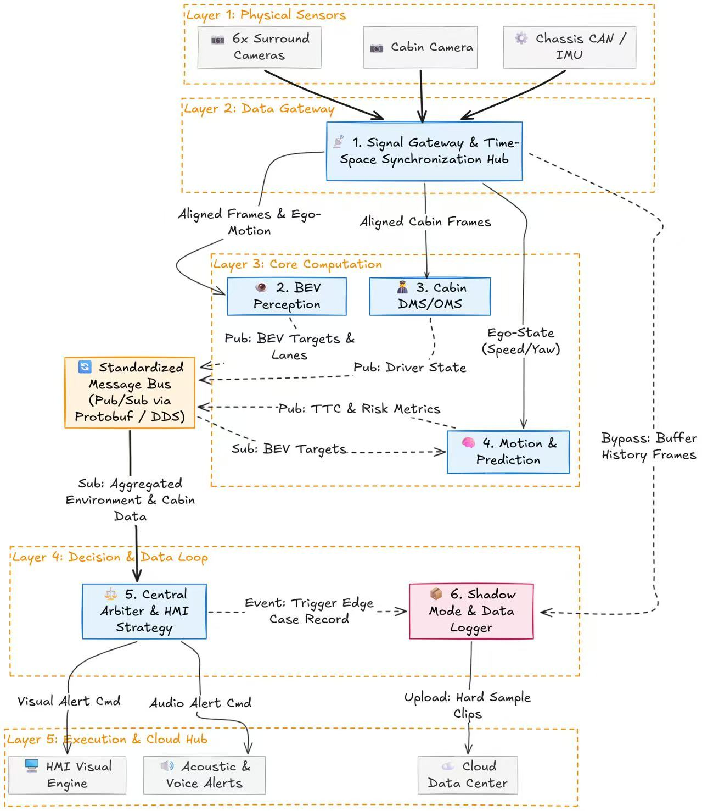

# AutoDriveLab

AutoDriveLab 是一个面向毕业设计展示的智能驾驶多源感知与风险融合系统。项目以 ROS2 为通信主干，围绕车外环境感知、驾驶员状态监测、摄像头质量评估、TTC 风险预测、中央仲裁决策和 HMI 可视化，构建从数据输入、算法推理、风险融合到最终告警展示的完整闭环。

本项目的展示重点不是单一模型指标，而是智能驾驶辅助系统的工程化集成能力：在统一消息协议下，将车外目标、相对距离、驾驶员状态、摄像头污染状态等异构输入转化为可解释的风险等级，并通过 Demo 视频、ROS2 节点和中间结果文件进行复现。

## Graduation Demo Goal

毕业设计展示围绕三个问题展开：

1. 智能驾驶系统如何同时接入车外感知、座舱监测和传感器质量信息。
2. 多源风险如何通过统一协议进入中央仲裁模块，形成稳定、可解释的告警结果。
3. 离线数据、模型推理、ROS2 联调和最终可视化如何形成一条可复现的工程链路。

当前版本已经支持三段 nuScenes 场景的慢速标准展示输出，并保留 JSONL 中间结果，方便答辩时逐帧解释每一次风险变化。

## System Architecture



系统按五层组织：底层传感器输入、数据网关与时空同步、核心算法计算、决策与数据闭环、执行与展示层。ROS2 消息和 Demo 级协议桥接贯穿各模块，使感知、预测、IQA、DMS 和 HMI 可以独立开发、统一联调。

## Web Showcase

项目 Web 展示站点：[http://47.96.112.124/](http://47.96.112.124/)

该站点用于介绍 AutoDriveLab 项目背景、系统架构、核心模块和 Demo 展示效果，便于答辩和项目展示时快速浏览整体成果。

## Demo Videos

标准展示视频统一采用 5 FPS 输出，相当于早期 10 FPS 版本的 1/2 速度，更适合答辩演示和逐帧讲解。

| Scene | Demo focus | Video |
|---|---|---|
| `scene-0061` | 城市场景目标跟踪、BEV 避障、TTC 风险提示 | [scene-0061 final_demo.mp4](docs/assets/demo_videos/scene-0061_final_demo.mp4) |
| `scene-0103` | 多目标交互、远近目标风险分层、HMI 状态联动 | [scene-0103 final_demo.mp4](docs/assets/demo_videos/scene-0103_final_demo.mp4) |
| `scene-0553` | 复杂静态障碍物过滤、BEV 合并显示、低速风险展示 | [scene-0553 final_demo.mp4](docs/assets/demo_videos/scene-0553_final_demo.mp4) |

## DMS Demo Results

DMS 测试覆盖正常驾驶、闭眼、打哈欠、抽烟、打电话和综合动作序列。完整 DMS demo 可视化视频已上传至云端：[DMS Demo Cloud Folder](https://autuni-my.sharepoint.com/:f:/g/personal/pms4244_autuni_ac_nz/IgD-9g_Iw1doR5GPKF6qbDdkAZaOfNe9lfY9STmsMzjgneM?e=TGPFiS)。项目同时提供 [DMS test demo runner](README_DMS_test_demo.md)，用于生成逐帧 `dms_status.jsonl` 和带风险状态叠加的 `dms_visualization.mp4`。

| Test video | Cabin state | DMS event | Risk level | Processed frames | Demo result |
|---|---|---|---:|---:|---|
| `test_normal.MOV` | 正常驾驶 | `DRIVER_NORMAL` | 0 | 110 | 正常状态，无疲劳或违规告警 |
| `test_eyeclosed.MOV` | 闭眼/疲劳 | `DRIVER_EYES_CLOSED` | 3 | 120 | 触发高危疲劳告警 |
| `test_yawn.MOV` | 打哈欠 | `DRIVER_YAWNING` | 2 | 88 | 触发疲劳预警 |
| `test_smoke.MOV` | 抽烟 | `DRIVER_SMOKING` | 2 | 236 | 触发驾驶违规预警 |
| `test_calling.MOV` | 打电话 | `DRIVER_CALLING` | 3 | 168 | 触发高危违规告警 |
| `test_all.MOV` | 综合动作序列 | `NORMAL / EYES_CLOSED / YAWNING / SMOKING / CALLING` | 0-3 | 796 | 覆盖完整 DMS 风险切换流程 |

## Technical Modules For Defense

| Owner | Module | Main packages / tools | Graduation-demo role |
|---|---|---|---|
| HanyueMo | Offline Scene Replay | `tools/export_nuscenes_demo_cache.py`, `signal_gateway` | 读取 nuScenes mini 场景，导出按时间戳对齐的图像、ego state 和回放索引 |
| HanyueMo | Model Perception Pipeline | `tools/model_inference/`, `demo_pipeline` | 接入 YOLO 目标检测与 Depth Anything 深度估计，生成 `pred_adas_objects.jsonl` 与 `pred_adas_status.jsonl` |
| Tingfeng Wang | ADAS / TTC Risk | `motion_prediction`, `tools/generate_adas_from_gt.py` | 根据目标距离、相对速度和 ego state 计算 TTC、碰撞等级和风险标签 |
| HenghaoWu | DMS Driver State | `dms_monitor`, `dms_module` | 输出疲劳、分心、闭眼等驾驶员状态，并接入仲裁链路 |
| HanyueMo | IQA Camera Quality | `iqa_monitor`, `iqa_mobilenetv2_reproduce` | 基于 MobileNetV2 的 normal / soiling 二分类质量检测，支持真实测试结果接入 |
| HanyueMo | Arbitration & HMI | `arbitration_module`, `hmi_interface` | 融合 ADAS、DMS、IQA 状态，生成统一告警、风险事件和展示层提示 |
| ChenyukeWang | ROS2 & Protocol Bridge | `autodrivelab_msgs`, `arbiter_can`, `demo_bringup` | 定义 ROS2 消息合同、Demo 级 CAN 映射和一键联调 launch 入口 |
| ChenyukeWang | Web Showcase | `http://47.96.112.124/` | 搭建项目 Web 展示站点，用于介绍项目背景、技术模块和 Demo 展示效果 |
| HanyueMo | BEV Rendering & Fusion | `bev_perception`, `tools/render_final_demo.py` | 统一 BEV 坐标、目标合并、静态障碍物降噪、ego 周边留白和最终画面渲染 |

## Reproducible Pipeline

```text
nuScenes scene replay
  -> object / distance perception
  -> pred_adas_objects.jsonl + pred_adas_status.jsonl
  -> DMS status + IQA status
  -> central arbitration / fusion
  -> ROS2 messages + protocol bridge
  -> final_demo.mp4
```

这条链路保留两类输出：一类是面向工程调试的 JSONL / ROS2 消息，另一类是面向答辩展示的最终视频。这样既能展示系统效果，也能解释每个风险等级背后的数据来源和决策依据。

## Repository Layout

```text
autodrivelab/
├── docs/                         # architecture docs, protocol docs and demo assets
│   └── assets/demo_videos/        # GitHub homepage demo videos
├── src/                          # ROS2 workspace packages
│   ├── autodrivelab_msgs/         # shared .msg contracts
│   ├── signal_gateway/            # scene replay and input gateway
│   ├── bev_perception/            # BEV object abstraction
│   ├── dms_monitor/               # driver state monitor
│   ├── iqa_monitor/               # camera quality monitor
│   ├── motion_prediction/         # TTC and risk metrics
│   ├── arbiter_can/               # protocol bridge and CAN abstraction
│   ├── arbitration_module/        # central fusion and decision logic
│   ├── hmi_interface/             # alert / display command sink
│   └── demo_bringup/              # ROS2 launch entrypoints
├── tools/                         # dataset export, inference, rendering and reports
├── iqa_mobilenetv2_reproduce/     # IQA training / evaluation reproduction
├── demo_outputs/                  # generated videos and JSONL outputs, ignored by git
├── data/                          # datasets, ignored by git
└── models/                        # model weights, ignored by git
```

## Quick Start

```bash
# From repo root
python3 -m venv .venv
source .venv/bin/activate
pip install -r requirements.txt

# In a ROS2 environment
colcon build --symlink-install
source install/setup.bash
ros2 launch demo_bringup autodrivelab_demo.launch.py
```

## Documentation

- [Architecture](docs/bishe_project_architecture.md)
- [ROS2 Demo Notes](README_ros2_demo.md)
- [IQA Integration](README_iqa_integration.md)
- [Protocol Boundary](docs/protocol/protocol_boundary_statement.md)
- [CAN Frame Mapping](docs/protocol/can_frame_mapping.md)
