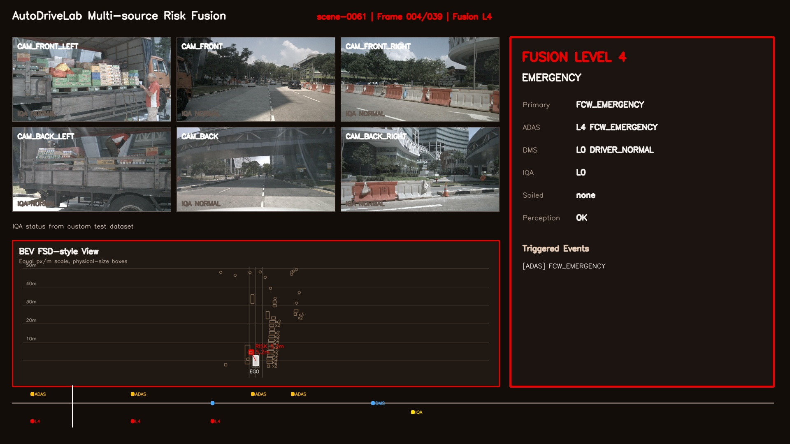
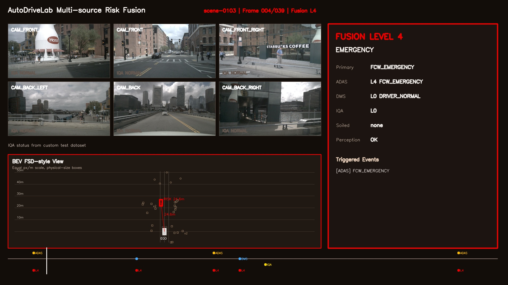
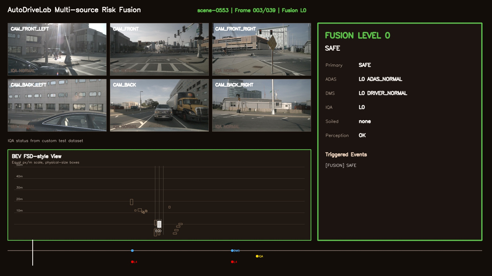

# AutoDriveLab

AutoDriveLab is a ROS2-based graduation demo system for multi-source intelligent-driving perception and risk fusion. It replays nuScenes mini scenes, runs ADAS/TTC risk reasoning, integrates DMS and IQA status, and presents the final arbitration result through BEV/HMI videos and ROS2 protocol messages.

[Web Showcase](http://47.96.112.124/) | [Demo Videos](#5-demo-videos) | [ROS2 Demo](README_ros2_demo.md) | [Chinese README](README_CN.md)



## 1. Demo Preview

The repository focuses on an explainable end-to-end demo rather than a single isolated model score. Each scene keeps intermediate JSONL outputs, ROS2 message contracts, and final visualizations so the risk state can be traced frame by frame.

```text
nuScenes replay
  -> object / distance perception
  -> ADAS TTC risk estimation
  -> DMS + IQA status integration
  -> central arbitration
  -> ROS2 protocol bridge
  -> BEV / HMI demo video + optional RViz2 3D view
```

## 2. What This Project Does

AutoDriveLab demonstrates how heterogeneous driving signals can be converted into a unified risk decision:

- Replays aligned nuScenes mini camera frames, ego state, and scene metadata.
- Generates ADAS object/status files from perception or scene-level replay inputs.
- Computes TTC-based front-collision risk with motion-trend gating.
- Integrates DMS driver-state events and IQA camera-quality classification.
- Fuses ADAS, DMS, and IQA into a central arbitration result.
- Exports ROS2 messages, CAN-style protocol frames, BEV/HMI videos, and optional RViz2 3D markers.

## 3. Implemented Scope

| Implemented item | Evidence in repo | Owner |
| --- | --- | --- |
| Offline scene replay | `tools/export_nuscenes_demo_cache.py`, `demo_pipeline/nuscenes_replay_node.py` | HanyueMo |
| ADAS / TTC risk reasoning | `motion_prediction`, `demo_pipeline` | Tingfeng Wang |
| YOLO + Depth Anything perception path | `tools/model_inference/run_yolo_depth_demo_pipeline.py` | HanyueMo |
| DMS driver-state integration | `dms_monitor`, `dms_module` | HenghaoWu |
| IQA camera-quality classification | `iqa_monitor`, `iqa_mobilenetv2_reproduce` | HanyueMo |
| Central arbitration | `arbitration_module` | Tingfeng Wang |
| HMI and BEV demo rendering | `hmi_interface`, `tools/render_final_demo.py` | HanyueMo |
| ROS2 message and protocol bridge | `autodrivelab_msgs`, `arbiter_can`, `demo_bringup` | ChenyukeWang |
| RViz2 3D visualization adapter | `autodrivelab_visualization` | ChenyukeWang |
| Web showcase | [http://47.96.112.124/](http://47.96.112.124/) | ChenyukeWang |

## 4. Not Claimed / Future Work

| Area | Current boundary |
| --- | --- |
| Real vehicle deployment | Not implemented. The demo uses offline scene replay and ROS2 simulation-style messages. |
| HIL / SIL certification | Not implemented. This is a graduation engineering prototype, not a certified safety system. |
| Certified AEBS | Not claimed. TTC logic is used for explainable demo-level collision-risk reasoning. |
| Real CAN bus control | Not implemented. `arbiter_can` provides a demo-level CAN-frame mapping boundary. |
| Full IQA data loop | Not implemented. Current work covers IQA status integration and defines a future data-loop boundary. |
| OTA / retraining pipeline | Not implemented. Model training artifacts and reproduction scripts are kept separate from deployment flow. |

## 5. Demo Videos

Standard videos are rendered at 5 FPS, which is half the speed of the early 10 FPS version and is easier to explain during defense.

| Scene | Preview | Demo focus | Video |
| --- | --- | --- | --- |
| `scene-0061` | [](docs/assets/demo_videos/scene-0061_final_demo.mp4) | Urban object tracking, BEV obstacle display, TTC risk hints | [MP4](docs/assets/demo_videos/scene-0061_final_demo.mp4) |
| `scene-0103` | [](docs/assets/demo_videos/scene-0103_final_demo.mp4) | Multi-object interaction, layered risk state, HMI status changes | [MP4](docs/assets/demo_videos/scene-0103_final_demo.mp4) |
| `scene-0553` | [](docs/assets/demo_videos/scene-0553_final_demo.mp4) | Static-obstacle filtering, BEV merge display, low-speed risk context | [MP4](docs/assets/demo_videos/scene-0553_final_demo.mp4) |

DMS demo videos are hosted in the [DMS Demo Cloud Folder](https://autuni-my.sharepoint.com/:f:/g/personal/pms4244_autuni_ac_nz/IgD-9g_Iw1doR5GPKF6qbDdkAZaOfNe9lfY9STmsMzjgneM?e=TGPFiS). The local runner is documented in [README_DMS_test_demo.md](README_DMS_test_demo.md).

## 6. Quick Start

Recommended environment:

- Ubuntu 22.04
- ROS2 Humble
- Python 3.10+
- nuScenes mini demo cache
- Model weights for YOLO, Depth Anything, DMS, and IQA when running model-backed demos

Install Python dependencies:

```bash
python3 -m venv .venv
source .venv/bin/activate
pip install -r requirements.txt
```

Build the ROS2 workspace:

```bash
source /opt/ros/humble/setup.bash
colcon build --symlink-install
source install/setup.bash
```

Run the ROS2 demo chain:

```bash
ros2 launch demo_bringup autodrivelab_demo.launch.py
```

Optional RViz2 3D view:

```bash
ros2 launch autodrivelab_visualization rviz_3d_markers.launch.py use_rviz:=true
```

Expected outputs include:

- ROS2 topics such as `/autodrivelab/bev/objects`, `/autodrivelab/risk_metrics`, and `/autodrivelab/rviz/objects`.
- JSONL files such as `adas_objects.jsonl`, `adas_status.jsonl`, `dms_status.jsonl`, `iqa_status.jsonl`, and `fusion_status.jsonl`.
- Demo videos such as `final_demo.mp4` and optional `ros2_3d_view.mp4`.

## 7. Repository Layout

```text
autodrivelab/
├── docs/                         # architecture docs, protocol docs, demo assets
│   └── assets/                   # homepage thumbnails and demo videos
├── src/                          # ROS2 workspace packages
│   ├── autodrivelab_msgs/         # shared .msg contracts
│   ├── signal_gateway/            # scene replay and input gateway
│   ├── bev_perception/            # BEV object abstraction
│   ├── motion_prediction/         # TTC and risk metrics
│   ├── dms_monitor/               # driver state monitor
│   ├── iqa_monitor/               # camera quality monitor
│   ├── arbitration_module/        # central fusion and decision logic
│   ├── arbiter_can/               # protocol bridge and CAN abstraction
│   ├── hmi_interface/             # alert / display command sink
│   ├── demo_bringup/              # ROS2 launch entrypoints
│   └── autodrivelab_visualization/ # optional RViz2 3D marker adapter
├── tools/                         # dataset export, inference, rendering, reports
├── iqa_mobilenetv2_reproduce/     # IQA training / evaluation reproduction
├── demo_outputs/                  # generated outputs, ignored by git
├── data/                          # datasets, ignored by git
└── models/                        # model weights, ignored by git
```

## 8. Module Map

| Module | Main packages / tools | Role |
| --- | --- | --- |
| Offline Scene Replay | `tools/export_nuscenes_demo_cache.py`, `signal_gateway`, `demo_pipeline` | Reads nuScenes mini scenes and exports aligned images, ego state, and replay indexes. |
| Model Perception Pipeline | `tools/model_inference`, `demo_pipeline` | Connects YOLO object detection and Depth Anything depth estimation to ADAS JSONL outputs. |
| ADAS / TTC Risk | `motion_prediction`, `demo_pipeline` | Computes TTC, collision level, and risk labels from object distance, relative motion, and ego state. |
| DMS Driver State | `dms_monitor`, `dms_module` | Produces fatigue, distraction, eye-closure, smoking, and phone-use status. |
| IQA Camera Quality | `iqa_monitor`, `iqa_mobilenetv2_reproduce` | Provides MobileNetV2 normal / soiling camera-quality classification and integration status. |
| Arbitration & HMI | `arbitration_module`, `hmi_interface` | Fuses ADAS, DMS, and IQA states into unified alerts and display commands. |
| ROS2 & Protocol Bridge | `autodrivelab_msgs`, `arbiter_can`, `demo_bringup` | Defines message contracts, launch entrypoints, and demo-level CAN mapping. |
| Visualization | `tools/render_final_demo.py`, `autodrivelab_visualization` | Renders BEV/HMI videos and optional RViz2 MarkerArray 3D views. |

## 9. Team Contributions

| Member | Contribution |
| --- | --- |
| HanyueMo | Offline scene replay, YOLO + Depth Anything perception path, IQA classification, HMI visualization, BEV rendering and fusion display. |
| Tingfeng Wang | ADAS/TTC risk logic, EKF/CTRV motion-prediction optimization, arbitration risk fusion, TTC-gated FCW behavior. |
| HenghaoWu | DMS driver-state module and driver-event integration into the arbitration chain. |
| ChenyukeWang | ROS2 message contracts, protocol bridge, launch integration, RViz2 3D visualization adapter, and web showcase. |

## 10. Documentation

- [Architecture](docs/bishe_project_architecture.md)
- [ROS2 Demo Notes](README_ros2_demo.md)
- [ROS2 RViz2 3D Visualization](docs/ros2_rviz_3d_visualization.md)
- [IQA Integration](README_iqa_integration.md)
- [Protocol Boundary](docs/protocol/protocol_boundary_statement.md)
- [CAN Frame Mapping](docs/protocol/can_frame_mapping.md)

## Language Note

The GitHub homepage is written in English for external review. A Chinese defense-oriented version is kept in [README_CN.md](README_CN.md).
